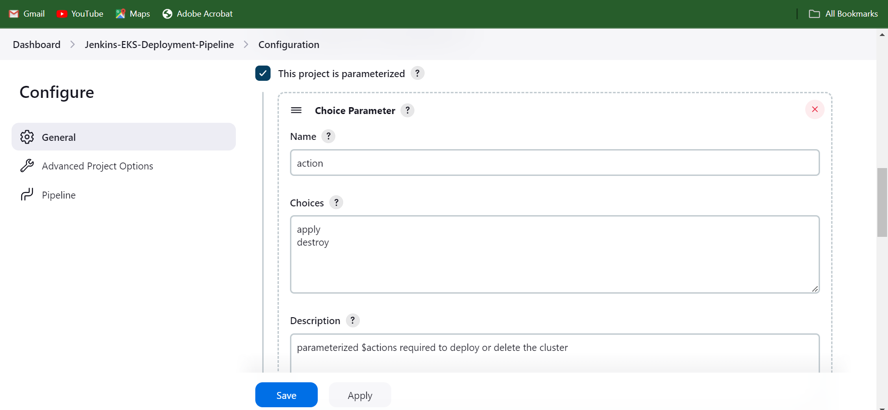
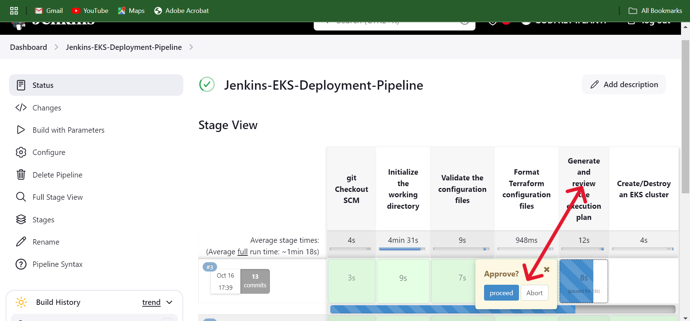
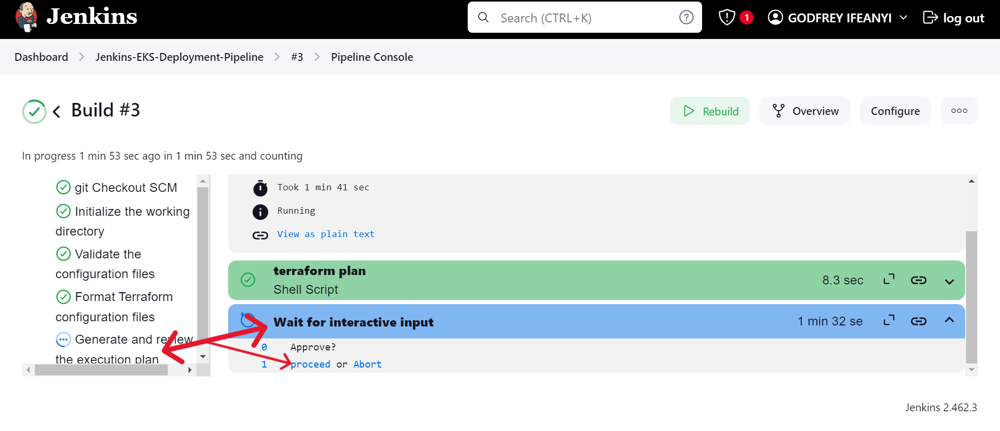

# Automated EKS Cluster Deployment Pipeline with Jenkins

This repository, `Automated-EKS-Cluster-Deployment-Pipeline`, contains the Jenkins pipeline setup to automate the deployment of an AWS Elastic Kubernetes Service (EKS) cluster using Terraform. This document provides a detailed guide on how to set up the Jenkins pipeline and run the automated deployment.

## Prerequisites

Before setting up the pipeline, ensure the following prerequisites are in place:

1. **Jenkins Server**: A Jenkins server must be up and running. You can use the Terraform code located in the repository folder `terraform-code-to-create-jenkins-server` to create and provision the Jenkins server on an AWS EC2 instance. The Terraform code installs the necessary applications such as Jenkins, Java (openjdk-17), Terraform, Docker, kubectl, and AWS CLI.
   
   - **Guide**: Detailed instructions for setting up the Jenkins server can be found in the `terraform-code-to-create-jenkins-server` folder.
   
2. **AWS IAM Credentials**: You will need to provide your AWS access keys (Access Key ID and Secret Access Key) to Jenkins for authentication and access to AWS resources.

3. **GitHub Credentials**: Ensure you have your GitHub credentials to provide Jenkins access to the repository where the pipeline code is stored.

## Jenkins Pipeline Setup

### 1. Install Jenkins Plugin
After the Jenkins server is set up, follow these steps:

- Access the Jenkins web interface using the server's IP and port `8080` (e.g., `http://<your-jenkins-ip>:8080`).
- Install the `Pipeline: Stage View` plugin from the Jenkins Plugin Manager.

### 2. Add AWS and GitHub Credentials in Jenkins

- Go to **Jenkins Dashboard** -> **Manage Jenkins** -> **Manage Credentials**.
- Click on **Global Credentials** (or the domain where you want to store the credentials).
- Add two credentials for AWS:
  - **AWS_ACCESS_KEY_ID**: Add as a Secret Text.
  - **AWS_SECRET_ACCESS_KEY**: Add as a Secret Text.
  
- Add your **GitHub Credentials** to allow Jenkins to access the Git repository:
  - Add the username and password (or personal access token) under **Git Credentials**.

### 3. Create the Jenkins Pipeline

- Go to **Jenkins Dashboard** -> **New Item**.
- Choose **Pipeline** and name it `Jenkins-EKS-Deployment-Pipeline`.
- Check **This project is parameterized** and add a **String Parameter**:
  - **Parameter Name**: `action`
  - **Default Values**: `apply` and `destroy` (This will either create or destroy the EKS cluster.)

### 4. Configure the Pipeline Script

- Under the **Pipeline** section, select **Pipeline script** and paste the following Jenkinsfile script:

```groovy
pipeline {
    agent any
    environment {
        AWS_ACCESS_KEY_ID = credentials('AWS_ACCESS_KEY_ID')
        AWS_SECRET_ACCESS_KEY = credentials('AWS_SECRET_ACCESS_KEY')
        AWS_DEFAULT_REGION = 'eu-west-1'
    }

    stages {
        stage('git Checkout SCM') {
            steps {
                script {
                    checkout scmGit(branches: [[name: '*/main']], extensions: [], userRemoteConfigs: [[credentialsId: 'git-cred', url: 'https://github.com/Godfrey22152/Automated-EKS-Cluster-Deployment-Pipeline.git']])
                }
            }
        }
        
        stage('Initialize the working directory') {
            steps {
                script {
                    dir('aws_eks_terraform_files'){
                        sh 'terraform init'
                    }
                }
            }
        }
        
        stage('Validate the configuration files') {
            steps {
                script {
                    dir('aws_eks_terraform_files'){
                        sh 'terraform validate'
                    }
                }
            }
        }
        
        stage('Format Terraform configuration files') {
            steps {
                script {
                    dir('aws_eks_terraform_files'){
                        sh 'terraform fmt'
                    }
                }
            }
        }
        
        stage('Generate and review the execution plan') {
            steps {
                script {
                    dir('aws_eks_terraform_files'){
                        sh 'terraform plan'
                    }
                    input(message: "Approve?", ok: "proceed")
                }
            }
        }
        
        stage('Create/Destroy an EKS cluster') {
            steps {
                script {
                    dir('aws_eks_terraform_files'){
                        sh 'terraform $action --auto-approve'
                    }
                }
            }
        }
    }
}
```
>**NOTE** For the stage `stage('git Checkout SCM')`:  
 Go to `**Pipeline Syntax**` then search for and select -> **`checkout: Check out from version control`** or **`git: Git*`* fillout the form and -> **`Generate amd copy Pipeline Script`**.
> **`See sample of the pipeline Script Below`**: `git branch: 'main', credentialsId: 'git-cred', url: 'https://github.com/Godfrey22152/Automated-EKS-Cluster-Deployment-Pipeline.git'` or `checkout scmGit(branches: [[name: '*/main']], extensions: [], userRemoteConfigs: [[credentialsId: 'git-cred', url: 'https://github.com/Godfrey22152/Automated-EKS-Cluster-Deployment-Pipeline.git']])`


### 5. Running the Jenkins Pipeline

1. Once you have configured the pipeline, click on **Build with Parameters** to trigger the pipeline, this will then require you to select an action either `apply` or `destroy` then you proceed to click `Build` button *(see Build with Parameter screenshoot image below)*.
2. During the pipeline execution, you will be prompted at the `Generate and review the execution plan` stage to approve the plan either by selecting `Proceed` or `Abort` before proceeding to create or destroy the EKS cluster. *(See screenshoot images of Approving Plan Execution below)*.  
3. After approval, the pipeline will be created and the cluster will be created but if you selected `Abort` at the `Generate and review the execution plan` stage the cluster deployment mission will be aborted.
4. In the same way, if you want to destroy an existing or running cluster, you should repeat `steps 1 to 3` but this time you should select `destroy` at the `build with parameters` stage *(The value of the `action` parameter (default: `apply` for creation, but this time select `destroy`)* and also select `Proceed` at the `Generate and review the execution plan` stage so as to destroy the EKS cluster. *(See screenshoot pictures below)*

   
### Screenshots

Here are the steps and the pipeline setup for deploying the EKS cluster:

#### 1. Pipeline Parameterization
 

#### 2. Build With Parameter


#### 2. Approving Plan Execution





---
### Verifying the EKS Cluster Deployment

After successfully deploying the EKS cluster using the Jenkins pipeline, follow these steps to verify that the cluster is up and running correctly.


#### 1. Get Cluster Details using AWS CLI

Use the following AWS CLI commands to check if the EKS cluster is deployed correctly.

##### a) List the EKS Clusters

```bash
aws eks list-clusters --region <your-region>
```
This command lists all EKS clusters in the specified region. Ensure that your newly created cluster appears in the list.

##### b) Describe the Cluster

```bash
aws eks describe-cluster --name <your-cluster-name> --region <your-region> --query "cluster.status"
```
This command provides the status of your EKS cluster. Look for the status `"ACTIVE"` to confirm that your cluster is successfully deployed.


#### 2. Configure `kubectl` to Interact with the EKS Cluster

Once the cluster is deployed, configure `kubectl` to interact with it by following these steps.

##### a) Update `kubeconfig` for the Cluster

```bash
aws eks update-kubeconfig --name <your-cluster-name> --region <your-region>
```
This command updates your local `kubectl` configuration to connect to your new EKS cluster.

##### b) Verify the Cluster Connection
To ensure that `kubectl` is correctly configured:

```bash
kubectl get svc
```
This command lists the default Kubernetes services running in the cluster. If the cluster is deployed correctly, you should see service details.


#### 3. Check Cluster Nodes

To verify that the nodes are properly deployed and in a ready state:

##### a) List the Nodes in the Cluster

```bash
kubectl get nodes
```
This command lists all the nodes in the EKS cluster. Ensure that the node status is `"Ready"`.


---

### Conclusion

This pipeline provides an automated and seamless way to manage the lifecycle of an EKS cluster using Terraform. You can update or customize the pipeline as necessary by modifying the Jenkinsfile.

## Repository Structure

- `terraform-code-to-create-jenkins-server/`: Contains the Terraform code to provision the Jenkins server on AWS.
- `aws_eks_terraform_files/`: Contains the Terraform configuration files for provisioning the EKS cluster.

## Contact

For issues or questions, please open an issue in the repository or contact the repository owner.
